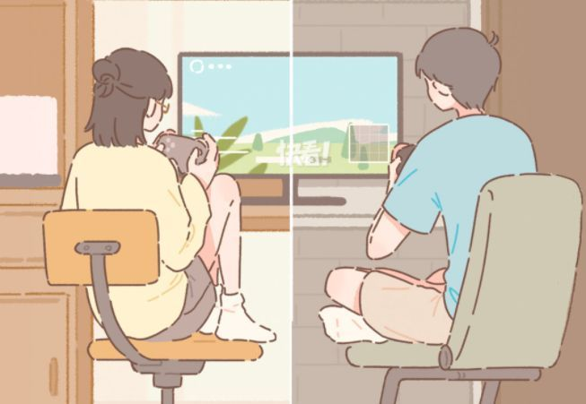
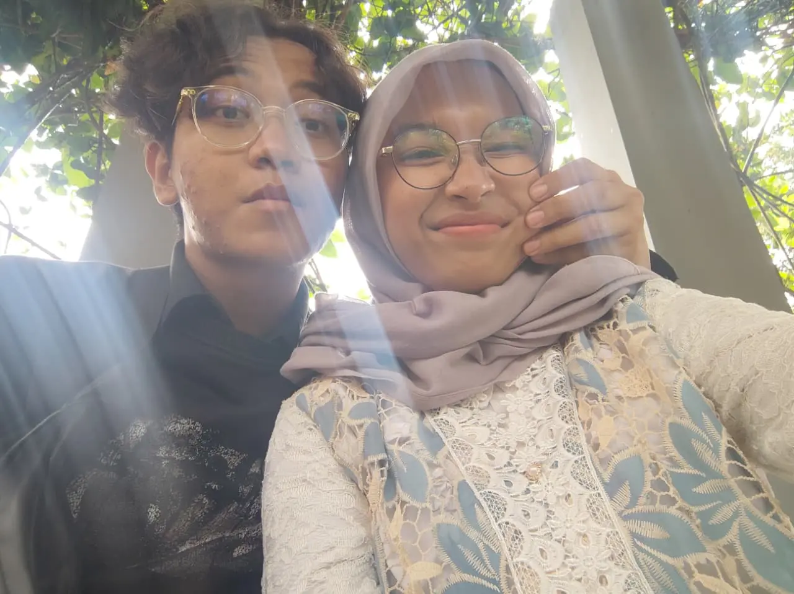
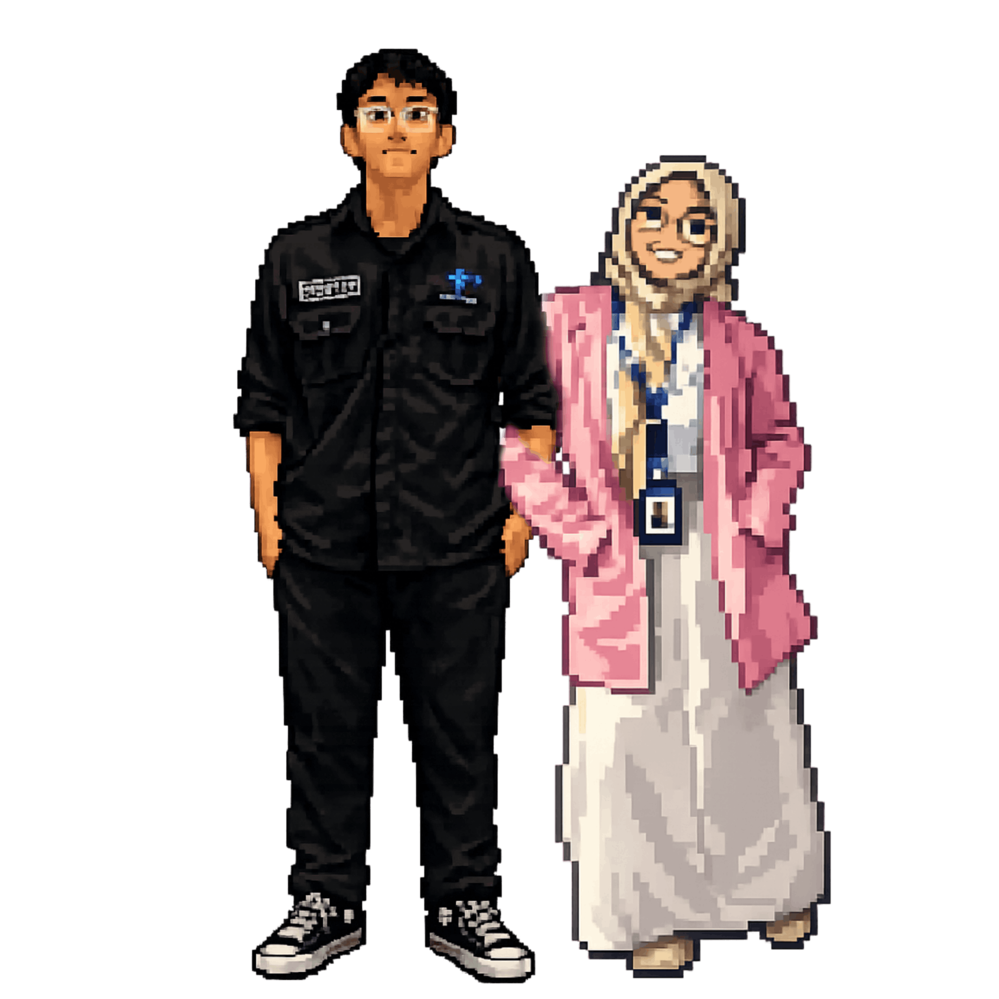

<!-- ============================================== -->
<!-- HEADER BORDER & BANNER -->
<!-- ============================================== -->

 

<h1>✨ Welcome to Love-Letter-LNK ✨</h1>

 &nbsp;&nbsp;&nbsp;  &nbsp;&nbsp;&nbsp; 

 

  <b>Halo! Selamat datang di markas rahasia Love-Letter-LNK!</b> 
  Sebuah ruang digital yang dirajut asyik dengan baris-baris kode,  didedikasikan spesial dan istimewa untuk ayang <b>Lia Nur Khasanah</b>. ❤️

<!-- QUOTE -->
 
<blockquote style="max-width: 600px; font-size: 14px;">
  <i>"Di dunia pemrograman, tidak ada sistem yang sempurna. Selalu ada <b>error</b> dan <b>bugs</b> yang bikin pusing. Tapi satu hal yang aku yakini: bersamamu, <b>source code</b> kehidupanku selalu berjalan mulus tanpa <b>syntax error</b>. You are the CSS to my HTML!"</i> 💻💖
</blockquote>
 

---

<!-- ============================================== -->
<!-- PROJECTS (DIBUAT GRID AGAR LAYOUT MENARIK) -->
<!-- ============================================== -->
<h3>💌 Project Kami  (Our Repositories)</h3>

<small>Setiap <i>repository</i> di sini ibarat kado virtual yang di-<i>compile</i> dengan penuh kasih sayang:</small>

<table align="center" width="600" style="border: 2px solid #ffb6c1; border-radius: 12px; text-align: center;">
  <tr>
    <td align="center" width="50%" style="padding: 15px; border-right: 1px dashed #ffb6c1; border-bottom: 1px dashed #ffb6c1;">
        
      <b>🎂 Happy Birthday Web</b> 
      <small>Kejutan manis yang dirancang khusus untuk merayakan hari paling spesialmu! Lengkap dengan doa dan harapan.</small>
    </td>
    <td align="center" width="50%" style="padding: 15px; border-bottom: 1px dashed #ffb6c1;">
        
      <b>🎁 Virtual Gift Box</b> 
      <small>Kumpulan kado digital berbentuk web yang siap dibuka kapan saja buat jadi mood booster.</small>
    </td>
  </tr>
  <tr>
    <td align="center" width="50%" style="padding: 15px; border-right: 1px dashed #ffb6c1;">
        
      <b>👩‍❤️‍👨 Our Journey Portfolio</b> 
      <small>Galeri foto yang menyimpan cerita gemes dan memori manis dari first date sampai sekarang.</small>
    </td>
    <td align="center" width="50%" style="padding: 15px;">
        
      <b>🌹 Random Surprises</b> 
      <small>Dapur proyek misterius... bakalan ada easter eggs kejutan yang muncul saat least expect it!</small>
    </td>
  </tr>
</table>

  

<!-- ============================================== -->
<!-- SOCIAL MEDIA BORDERED LAYOUT -->
<!-- ============================================== -->
<h3>🌐 Let's Connect (Our Social Media)</h3>

<small>Kepo kita? Langsung hubungi kita di bawah ini ya! 🚀</small>

<table align="center" width="600" style="border: 2px dashed #ffb6c1; border-radius: 12px; padding: 10px; text-align: center; background-color: rgba(255,182,193,0.05);">
  <tr align="center">
    <td width="50%">
      <h4>👦 Zakaria</h4>
    </td>
    <td width="50%">
      <h4>👧 Lia Nur Khasanah</h4>
    </td>
  </tr>
  <tr align="center">
    <td style="padding-bottom: 8px;">
      
    </td>
    <td style="padding-bottom: 8px;">
      
    </td>
  </tr>
  <tr align="center">
    <td style="padding-bottom: 8px;">
      
    </td>
    <td style="padding-bottom: 8px;">
      
    </td>
  </tr>
  <tr align="center">
    <td style="padding-bottom: 8px;">
      
    </td>
    <td style="padding-bottom: 8px;">
      
    </td>
  </tr>
</table>

   

<!-- ============================================== -->
<!-- FOOTER BORDER & CLOSING -->
<!-- ============================================== -->

  <small><b>LiaaZekk 2026</b>   Built with  and lots of late-night code.</small>

<!-- (Kita juga pakai image.png dengan lebar yang sama sebagai penutup) -->

